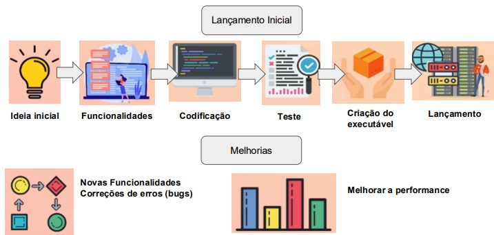
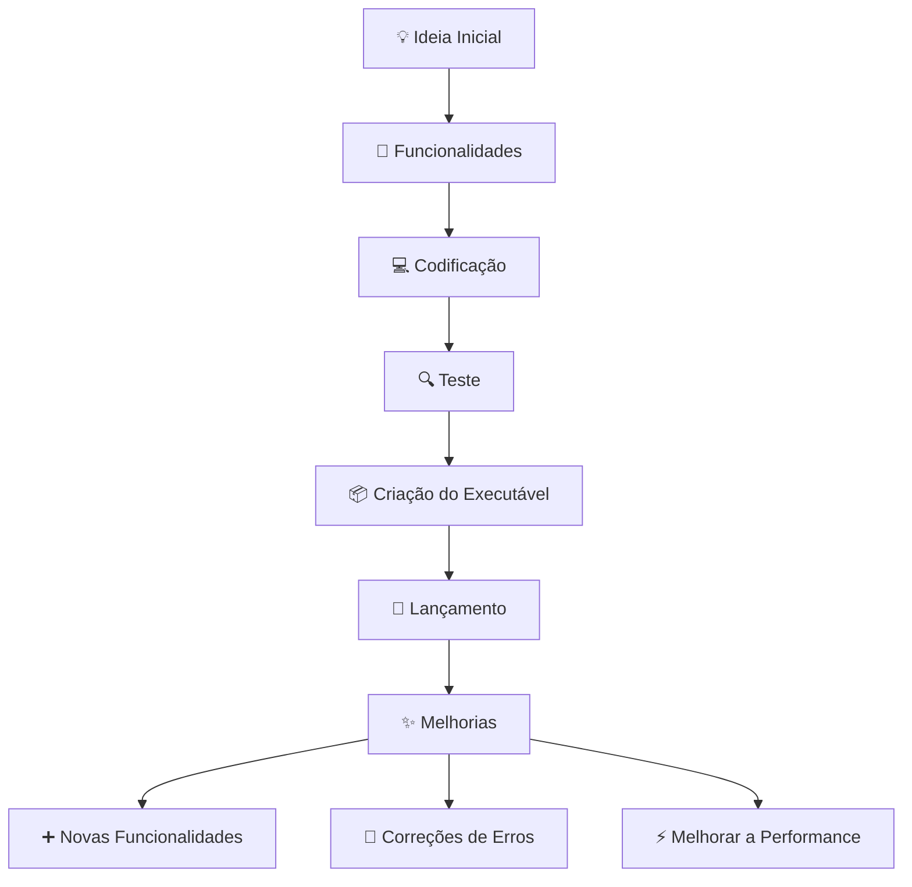
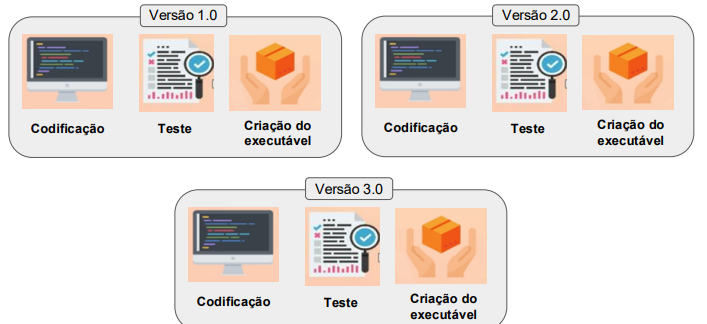
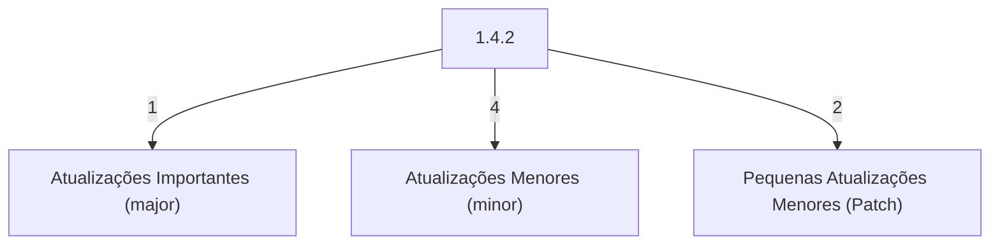
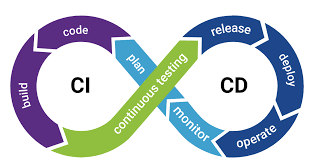

# CI/CD com GitLab

Olá! Eu sou o Uanderson, um desenvolvedor backend Java em formação, e hoje vamos falar sobre CI/CD, Docker, Kubernetes e GitLab.

## Ciclo de desenvolvimento de software

## Versionamento

## Versionamento

- 1.0 -> Versão Inicial
- 1.1 -> Atualizações menores (adição de novas features)
- 1.1.1 -> Patch (correção de um pequeno bug)
- 1.2 -> Atualizações menores (melhoria de desempenho)
- 2.0 -> Atualização Importante (troca de layout)
- 2.0.1 -> Patch (correção na tradução)

## Ciclo de entrega de software (Eterno/Continuo)

Fonte: [Importância da Integração Contínua e Entrega CI/CD de Moderno - Thales](https://pt.linkedin.com/pulse/import%C3%A2ncia-da-integra%C3%A7%C3%A3o-cont%C3%ADnua-e-entrega-cicd-de-moderno-thales-q9waf)

1. **Plan** (Planejar): Definimos o que será feito e as funcionalidades que queremos desenvolver.

2. **Code** (Codificar): Os desenvolvedores escrevem o código para implementar as funcionalidades planejadas.

3. **Build** (Construir): O código é compilado e transformado em um executável, preparando-o para os testes.

4. **Continuous Testing** (Teste Contínuo): Testes automatizados são realizados para verificar se o código funciona como esperado e se não há bugs.

5. **Release** (Liberar): O software é preparado para ser liberado. Isso inclui documentação e verificação final.

6. **Deploy** (Implantar): A nova versão do software é implantada em um ambiente de produção, onde os usuários podem acessá-la.

7. **Operate** (Operar): O software é monitorado em operação para garantir que funcione corretamente e para identificar problemas rapidamente.

8. **Monitor** (Monitorar): Acompanhamos o desempenho e a experiência do usuário, coletando feedback para futuras melhorias.

Esse ciclo é contínuo, ou seja, assim que uma nova funcionalidade ou correção é desenvolvida, ele recomeça, garantindo entregas frequentes e de qualidade.

Vamos entender o conceito de **Deploy** e os ambientes envolvidos no processo, a partir das suas anotações.

### O que é Deploy?

**Deploy** é o processo de mover o software de um ambiente controlado (como desenvolvimento ou teste) para outro ambiente, geralmente o ambiente de produção. É uma etapa crucial no ciclo de entrega de software, pois é quando o software se torna acessível aos usuários finais.

### Ambientes Comuns

1. **Desenvolvimento (Dev)**:
   - **Função**: Aqui, os desenvolvedores escrevem e constroem o código.
   - **Características**: Este ambiente é geralmente flexível, permitindo alterações rápidas e testes iniciais.

2. **Integração (Staging)**:
   - **Função**: Neste ambiente, o novo código é combinado com o código existente e validado.
   - **Características**: O objetivo é replicar o ambiente de produção o mais próximo possível. Isso garante que o software funcione corretamente em condições semelhantes às que enfrentará quando for lançado.

3. **Teste**:
   - **Função**: Aqui, são realizados testes funcionais (para verificar se as funcionalidades funcionam) e não funcionais (como desempenho e segurança).
   - **Características**: É um ambiente controlado onde a equipe de QA (Quality Assurance) pode confirmar que o software atende aos requisitos antes do lançamento.

4. **Produção**:
   - **Função**: Este é o ambiente onde o software é disponibilizado aos usuários finais.
   - **Características**: Qualquer falha aqui pode afetar os usuários, então é crucial que o código que chega a esse ambiente seja bem testado e estável.

## O que é CI/CD na prática?

**CI/CD** são práticas essenciais no desenvolvimento de software moderno, garantindo que o processo de integração, teste e entrega de código seja feito de forma automatizada, rápida e confiável. Vamos entender cada um desses conceitos mais profundamente:

### **CI (Continuous Integration - Integração Contínua)**

A Integração Contínua é o processo em que desenvolvedores integram suas alterações de código com frequência em um repositório central. A ideia principal é evitar o acúmulo de muitas mudanças não testadas e difíceis de integrar. Cada alteração acionará um processo de criação e testes automáticos, garantindo que o sistema como um todo continue funcionando após cada commit. Isso reduz significativamente o tempo necessário para identificar e corrigir erros.

Objetivos principais:

- Detectar e corrigir erros o quanto antes (feedback rápido).
- Manter um código funcional em todas as etapas.
- Facilitar a colaboração entre desenvolvedores, integrando mudanças constantemente.
- Automatizar a criação e os testes, garantindo que o código estável seja sempre o resultado.

### **CD (Continuous Delivery ou Continuous Deployment - Entrega Contínua ou Implantação Contínua)**

A entrega contínua é uma prática de desenvolvimento de software em que
alterações de código são criadas, testadas e preparadas automaticamente
para liberação para produção. Ela expande com base na integração
contínua, pela implantação de todas as alterações de código em um
ambiente de teste e/ou ambiente de produção, após o estágio de criação.
Quando a integração contínua for implementada adequadamente, os
desenvolvedores sempre terão um artefato de criação pronto para ser
implantado, e que passou por um processo de teste padronizado.

A Entrega Contínua e a Implantação Contínua são evoluções do CI. A diferença entre elas está no grau de automação da entrega do software.

- **Continuous Delivery (Entrega Contínua)**: Após a integração e teste bem-sucedidos, o código está pronto para ser implantado em produção a qualquer momento. No entanto, a implantação em produção pode ser feita manualmente. O objetivo é garantir que o software esteja sempre em um estado de lançamento, mas com um controle final do time sobre o momento da liberação.

- **Continuous Deployment (Implantação Contínua)**: Leva a automação um passo adiante. Aqui, toda mudança que passa pelos testes é automaticamente implantada em produção, sem a necessidade de intervenção manual. Isso permite uma entrega mais rápida de novas funcionalidades e correções aos usuários.

### Metáfora para facilitar o entendimento

Imagine que você está construindo um software como uma casa. Cada desenvolvedor adiciona uma "peça" à construção. O **CI** seria o processo de testar e verificar cada peça para garantir que ela se encaixa bem na estrutura geral, sem comprometer a integridade da casa. Já o **CD** seria o processo de garantir que, uma vez que todas as peças estão no lugar e a casa está "pronta", ela pode ser disponibilizada para o morador (usuário final) sem precisar de ajustes de última hora.

### Benefícios do CI/CD

- **Detecção precoce de erros**: O CI ajuda a identificar problemas no código rapidamente.
- **Entrega mais rápida e confiável**: O CD permite lançamentos frequentes e consistentes.
- **Redução do risco**: Testes contínuos garantem que o código esteja sempre estável e pronto para produção.
- **Automação do processo**: Menos tarefas manuais e maior foco no desenvolvimento de novas funcionalidades.

---
