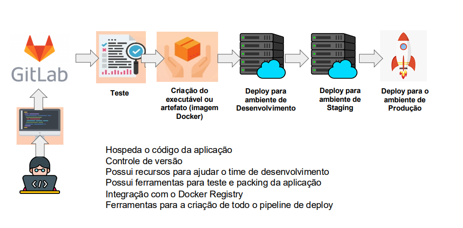

# GitLab

Olá, eu sou o Uanderson, um desenvolvedor Backend Java em formação, e hoje vamos desmistificar o GitLab e entender como ele pode ser uma ferramenta essencial para trabalhar em equipe e em projetos reais.

### O que é o GitLab?

Para começar, vamos imaginar que você está organizando uma grande festa. O GitLab é como a plataforma onde você planeja todos os detalhes dessa festa: desde o local, a lista de convidados, até a decoração e a comida. É um lugar onde tudo acontece de forma colaborativa e estruturada. Assim como você precisa de uma lista de tarefas e de alguém para coordenar tudo, o GitLab ajuda a organizar e gerenciar projetos de software.

Resumindo, o GitLab é um repositório Git que fornece repositórios abertos e privados e
outros recursos. É uma plataforma completa de DevOps que permite que
os profissionais executem todas as tarefas em um projeto, desde o
planejamento do projeto, passando pelo gerenciamento do código-fonte
até o monitoramento e a segurança.

### Repositório de Código

Um dos principais recursos do GitLab é o repositório Git. Pense nele como uma biblioteca digital onde você armazena o código da sua aplicação. Esse repositório pode ser **aberto** (onde qualquer um pode ver e contribuir) ou **privado** (onde apenas pessoas autorizadas têm acesso). Ter um controle de versão é como manter um diário de tudo o que foi feito na sua festa. Se você decidir que a decoração não estava boa, pode voltar e ver como estava antes e até restaurar essa versão se precisar.

### Controle de Versão

O controle de versão é fundamental. Imagine que você está fazendo uma receita de bolo e decide mudar a quantidade de açúcar. Se não der certo, você precisa voltar à receita original. Com o GitLab, isso é possível: você pode voltar a versões anteriores do seu código, corrigir erros ou até comparar alterações. Assim, você mantém um histórico claro de todas as mudanças, facilitando a colaboração.

### Recursos para o Time de Desenvolvimento

Uma das melhores coisas sobre o GitLab é que ele oferece recursos que ajudam toda a equipe de desenvolvimento. Tem ferramentas para planejar o que será feito, como um quadro de tarefas (o famoso Kanban). Pense nisso como o cronograma da sua festa, onde você pode ver quem está responsável por cada tarefa e o que ainda precisa ser feito.

### Testes e Empacotamento

Outra funcionalidade incrível do GitLab são as ferramentas para teste e empacotamento da aplicação. Após desenvolver uma nova funcionalidade, é essencial testá-la para garantir que tudo funcione como deveria. O GitLab permite que você crie um ambiente de testes automaticamente, assim como você testaria a receita do bolo antes da festa. Se o bolo não sair como planejado, você pode ajustar a receita antes de servir aos convidados.

### Integração com Docker Registry

Agora, se você está se perguntando sobre o Docker, imagine que cada parte da sua festa (decoração, comida, música) precisa de um espaço próprio para ser armazenada e organizada. O Docker Registry faz isso para suas aplicações. Ele permite que você crie imagens de contêineres que podem ser facilmente armazenadas e compartilhadas no GitLab, garantindo que todos os componentes do seu software funcionem em qualquer ambiente.

### Pipeline de Deploy

Por fim, temos as ferramentas para a criação de pipelines de deploy. Isso é como ter um plano bem detalhado para sua festa, onde você sabe exatamente quando cada parte deve acontecer: a entrega do bolo, a chegada dos convidados, a música começando. No GitLab, você configura etapas que vão desde a construção do seu código até o seu lançamento, garantindo que tudo ocorra de forma organizada e eficiente.

### Conclusão

Então, em resumo, o GitLab é uma plataforma poderosa que não só hospeda o código da sua aplicação, mas também oferece uma gama de ferramentas para ajudar equipes a colaborar, testar e implantar software de maneira eficiente. Com essa ferramenta, você estará mais do que preparado para participar de projetos reais no mercado de trabalho. Agora, que tal explorar um pouco mais o GitLab e começar a aplicar tudo isso na prática? Estou aqui para qualquer dúvida que você tenha!

---

